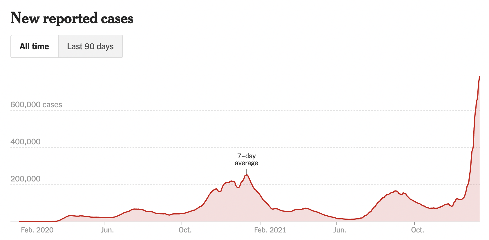
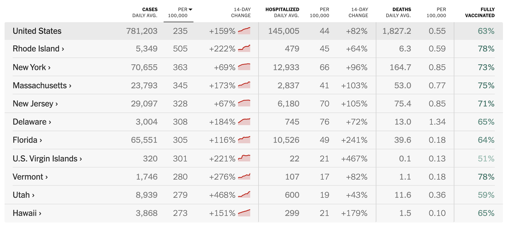

In May 2020, the Georgia Department of Public Health posted the following plot to illustrate the number of confirmed COVID-19 cases in their hardest-hit counties over a two-week period. Health officials claimed that the plot provided evidence that COVID-19 cases were decreasing and made the argument for reopening the state.

{ width=75% }

The plot was heavily criticized by the statistical community and several media outlets for its deceptive portrayal of COVID-19 trends in Georgia. Whether the end result was due to malicious intent or simply poor judgment, it is incredibly irresponsible to publish data visualizations that obscure and distort the truth. 

Data visualization is an incredibly powerful tool that can affect health policy decisions. Ensuring they are easy to interpret, and more importantly, showcase accurate insights from data is paramount for scientific transparency and the health of individuals. For this assignment you are tasked with reproducing COVID-19 visualizations and tables published by the [New York Times](https://www.nytimes.com/interactive/2020/us/coronavirus-us-cases.html).
Specifically, you will attempt to reproduce the following for January 12th, 2022:

1. New cases as a function of time with a rolling average plot - the first plot on the page (you don't need to recreate the colors or theme)
2. Table of cases, hospitalizations and deaths - the first table on the page
3. The county-level map for previous week ('Hot spots') - the second plot on the page (only the 'Hot Spots' plot)
4. Table of cases by state - the second table on the page (do not need to include per 100,000, 14-day change, or fully vaccinated columns columns)

Data for cases and deaths can be downloaded from this [NYT GitHub repository](https://github.com/nytimes/covid-19-data) (use `us-counties.csv`). Data for hospitalizations can be downloaded from [The COVID Tracking Project](https://covidtracking.com/data). The project must be submitted in the form of a Jupyter notebook or RMarkdown file and corresponding compiled/knitted PDF, with commented code and text interspersed, including a **brief critique of the reproducibility of each plot and table**. All project documents must be uploaded to a GitHub repository each student will create within the [reproducible data science organization](https://github.com/reproducibleresearch). The repository must also include a README file describing the contents of the repository and how to reproduce all results. You should keep in mind the file and folder structure we covered in class and make the reproducible process as automated as possible.

```{r, warning=FALSE, echo=FALSE, message=FALSE}
# Load libraries
library(ggplot2)
library(tidyverse)
library(stringr)
library(zoo)
library(lubridate)
library(kableExtra)
library(ggthemes)
library(RColorBrewer)
library(pander)
library(maps)
library(usmap)
```

### Tasks

## Task #1

Create the new cases as a function of time with a rolling average plot - the first plot on the page (you don't need to recreate the colors or theme).



### Load data

```{r}
# load data for cases
us_counties = read.csv(url("https://raw.githubusercontent.com/nytimes/covid-19-data/master/us-counties.csv")) 
us_counties = us_counties %>% mutate(date = ymd(date)) # convert date

```

### First Plot (Hand calculated rolling average)

```{r}
first_plot = us_counties %>% group_by(date) %>% # group by date
  summarise(cases = sum(cases), deaths = sum(deaths, na.rm = T)) %>% # summarize to get total cases per day
  mutate(new_cases = cases - lag(cases), new_deaths = deaths - lag(deaths)) %>% # use lag to find new cases
  mutate(new_cases_7dayavg = rollmean(new_cases, k = 7, fill = NA, align = "right")) # calculate 7-day avg
```

### Generate Plot

```{r, warning=F, fig.width=14, fig.height=8}
first_plot %>% ggplot(aes(date, new_cases_7dayavg)) + # plot of 7-day avg.
  geom_line(color = "red", size = 1.5) + # add line
  geom_area(fill = "#F8766D", alpha = 0.3) + # add shading beneath line
  ggtitle("New Reported Cases (All Time)") + # add title
  scale_y_continuous(name = "", breaks = c(200000, 400000, 600000), # add ticks to y-axis
                     labels = c("200,000", "400,000", "600,000 cases")) +
  scale_x_date(name = "", 
               breaks = 
                 ymd(c("2020-02-01", "2020-06-01", "2020-10-01", "2021-02-01", # add dates to x-axis
                       "2021-06-01", "2021-10-01")), 
               labels = c("Feb. 2020", "Jun.", "Oct.", "Feb. 2021", "Jun.", "Oct.")) +
  theme_economist_white() + # change theme
  geom_text(aes(x = ymd("2021-01-05"), y = 330000, label = "7-day"), # add text for 7-day average
            color = "black", 
            size = 4) + 
  geom_text(aes(x = ymd("2021-01-05"), y = 300000, label = "average"), 
            color = "black", 
            size = 4) + 
  geom_text(aes(x = ymd("2021-01-05"), y = 270000, label = "|"), 
            color = "black", 
            size = 4)

```


## Task #2 
Create the table of cases and deaths - the first table on the page, right below the figure you created in task #1. You don't need to include tests or hospitalizations. 

{ width=75% }

### Task 2 Code (hand calculated rolling average)

```{r}
first_plot = first_plot %>% # calculate rolling means
  mutate(new_cases_daily_avg = rollmean(new_cases, k = 7, fill = NA, align = "right"), 
         new_deaths_daily_avg = rollmean(new_deaths, k = 7, fill = NA, align = "right"))

first_table = first_plot %>% # filter dates and columns
  filter(date %in% ymd("2021/12/29", "2022/01/12")) %>% 
  select(new_cases_daily_avg, new_deaths_daily_avg)
```


### Create Table

```{r}
# Percent Change:
# (old_cases - new_cases) / old_cases * 100
temp = data.frame(
  Column1 = c("Cases", "Deaths"), # calculate percent change after 2 weeks
  Daily_Avg = c(floor(first_table$new_cases_daily_avg[2]), floor(first_table$new_deaths_daily_avg[2])),
  Change = c(floor((first_table$new_cases_daily_avg[2] - first_table$new_cases_daily_avg[1]) / 
                     first_table$new_cases_daily_avg[1] * 100),
             floor((first_table$new_deaths_daily_avg[2] - first_table$new_deaths_daily_avg[1]) / 
                     first_table$new_deaths_daily_avg[1] * 100)
            )
)

temp$Change = c(paste("+", temp$Change[1], "%", sep = ""), # add details for table
                paste("+", temp$Change[2], "%", sep = ""))

colnames(temp) = c("", "DAILY AVG. ON JAN. 12", "14-DAY CHANGE") # change column names
pander(temp)
```

&nbsp;

&nbsp;

## Task #3
Create the county-level map for previous week ('Hot spots') - the second plot on the page (only the 'Hot Spots' plot). You don't need to include state names and can use a different color palette. 

{ width=85% }

### Task 3 Code (Rolling average from NYT data)

```{r}
# load NYT data for 2022
counties_2022 = read.csv(url("https://raw.githubusercontent.com/nytimes/covid-19-data/master/rolling-averages/us-counties-2022.csv")) 

counties_2022 = counties_2022 %>% filter(date == "2022-01-12") %>% # filter date
  select(county, state, cases_avg_per_100k) %>% # select columns
  mutate(region = str_to_lower(state), # change state/county names to lowercase
         subregion = str_to_lower(county)) %>% 
  select(-c(state, county))

counties_2022 = counties_2022 %>% 
  mutate(subregion = str_replace(subregion, "\\.", "")) %>% # remove periods
  mutate(subregion = str_replace_all(subregion, " ", "")) %>% # remove spaces
  mutate(subregion = str_replace_all(subregion, "'", "")) # remove apostrophes
```

### Map data

```{r}
AllCounty = map_data("county") # load county data with latitude/longitude
AllCounty = AllCounty %>% 
  mutate(subregion = str_replace_all(subregion, " ", "")) # remove spaces

final_data = AllCounty %>% 
  left_join(counties_2022, by = c("region", "subregion")) # join data.frames

```

### Plot map

```{r, fig.width=18, fig.height=12, warning=F}
final_data$cat_cases = final_data$cases_avg_per_100k
final_data$cat_cases[final_data$cat_cases > 250] = 300 # truncate values above 250 to match NYT map

final_data %>% ggplot(aes(long, lat, group = group, fill = cat_cases)) + # plot map
                geom_polygon(color = "white", size = .1) + # add geometry and reduce line width
                scale_fill_gradientn(name = "Cases Avg. Per 100,000", # change legend title
                                     colors = brewer.pal(9, "YlOrRd"), 
                                     trans = "log10", # use log-10 transform
                                     limits = c(1, 300),
                                     breaks = c(0, 10, 50, 250)) +
                theme(panel.grid.major = element_blank(), # remove grids/axes
                      panel.background = element_blank(),
                      axis.title = element_blank(), 
                      axis.text = element_blank(),
                      axis.ticks = element_blank()) +
                coord_fixed(1.3) # fix ratio of y and x

```

&nbsp;

### (Optional) List of counties that didn't match up with NYT case data

```{r}
unique(final_data %>% # county names that don't match
         filter(is.na(final_data$cases)) %>% select(region, subregion)
       ) 
```

&nbsp;

## Task #4 

Create the table of cases by state - the second table on the page (do not need to include per 100,000, 14-day change, or fully vaccinated columns).




### Task 4 Code (hand calculated rolling average)

```{r, message=F}
second_table = us_counties %>% group_by(state, date) %>% # group by date and state
    summarise(cases = sum(cases, na.rm = T)) %>% # summarize to get total cases per day
    mutate(new_cases = cases - lag(cases)) %>%
    mutate(new_cases_daily_avg = 
             round(rollmean(new_cases, k = 7, fill = NA, align = "right"))) %>% 
    filter(date == ymd("2022/01/12")) %>% 
    select(state, new_cases_daily_avg)
```

### Create Table

```{r}
dat = data.frame(state = "United States",
                 new_cases_daily_avg = sum(second_table$new_cases_daily_avg))

second_table = rbind.data.frame(dat, second_table)

colnames(second_table) = c("State", "Cases Daily Avg.")
pander(second_table)

```

## Task #5

Provide a brief critique of the reproducibility of the figures and tables you created in tasks 1-4. 

**These figures presented various challenges to reproducibility. The first and foremost can be easily seen by the various data sources that I used throughout this .RMD file. My first plot uses the 7-day rolling average that was calculated by hand. This, as my astute colleagues pointed out, was unnecessary as the NYT GitHub already had these averages calculated. In addition, there was confusion that arose from how the rolling average is defined. Heather provided code for a rolling average that uses the values to the left and right of a given point, while the NYT may have actually calculated the average using only the values to the left of a point ("trailing average"). For the second task, I opted to use this trailing average instead as it led to results that were closet to that of the NYT. The third task was the one I spent the most time on over the weekend due to the difficulties of merging the county level data sets from `usmaps` and the NYT repo. Some of the discrepancies included whether a space was used ("de kalb" vs "dekalb"), and whether capital letters and/or periods were used ("st mary" vs "St. Mary"). My merging did leave some counties that couldn't be matched for such processing reasons (see above), which further illustrates the difficulties of data cleaning. The fourth task was the simplest as it was similar to task 2 but at the state level.**

**Now, in terms of positives, the NYT follows many of the principles outlined in the EdX videos. First off, it is clear that the NYT data team spent a lot of time planning how to best store and organize the data to best serve the scientific community. As Prof. Huttenhower alluded to, much time can be saved during the analysis if you devote the time and effort in the planning stages to identify potential problems before they occur. (Most) of the data is stored on GitHub, which is public and free to download (no pay walls). There also is an in-depth `README` with definitions for all the metrics and caveats on potential inaccuracies. This ease of accessibility greatly improves the ability of researchers to verify the NYT's results and draw their own conclusions. Moreover, the documentation makes it easy to understand what the data actually measures. All these steps will help mitigate confusion among those that utilize this data now and in the future (people will probably be using this data for decades).**

**After considering the above, the NYT deserves a Grade of `B+` for reproducibility.**


&nbsp;
